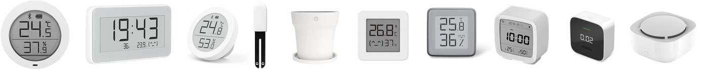
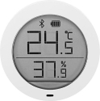
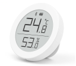
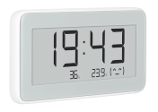
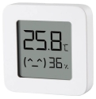
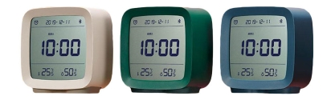
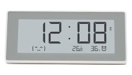
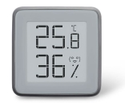
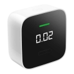
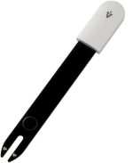

# Introduction
This project provides an Xiaomi sensor poller supporting Home Assistant's MQTT format. This includes auto discovery and continual metric updates.
Example deployment on a RaspBerry PI for a distributed collection of Xiaomi BLE advertisements.

# Credits
The project is based on code from https://github.com/custom-components/ble_monitor and https://github.com/home-assistant/core/tree/dev/homeassistant/components/miflora

# Supported devices
Overview


- LYWSDCGQ

  (round body, segment LCD, broadcasts temperature, humidity and battery level, about 20 readings per minute)
  
  
  
- CGG1

  (round body, E-Ink, broadcasts temperature, humidity and battery level, about 20 readings per minute)

  

- LYWSD02

  (rectangular body, E-Ink, broadcasts temperature, humidity and battery level (battery level is available for firmware version 1.1.2_00085 and later), about 20 readings per minute)

  
  
- LYWSD03MMC

  (small square body, segment LCD, broadcasts temperature and humidity once in about 10 minutes and battery level once in an hour. Supports both sensors with original firmware as well as custom firmware as explained [here](https://github.com/atc1441/ATC_MiThermometer) (make sure you set advertising type to mi-like). With the original firmware, advertisements are encrypted, therefore you need to set an encryption key in your configuration, see for instructions the [encryption_key](#encryption_key) option (not needed for sensors with custom firmware))
  
  

- CGD1

  (Cleargrass (Qingping) CGD1 alarm clock, segment LCD, broadcasts temperature and humidity (once in about 3 minutes?), and battery level (we do not have accurate periodicity information yet), advertisements are encrypted, therefore you need to set the key in your configuration, see for instructions the [encryption_key](#encryption_key) option)

  

- MHO-C303

  (Alarm clock, rectangular body, E-Ink, broadcasts temperature, humidity and battery level, about 20 readings per minute)
  
  

- MHO-C401
  
  (small square body, E-Ink display, broadcasts temperature and humidity once in about 10 minutes and battery level once in an hour, advertisements are encrypted, therefore you need to set the key in your configuration, see for instructions the [encryption_key](#encryption_key) option)
  
  

- JQJCY01YM

  (Xiaomi Honeywell Formaldehyde Sensor, OLED display, broadcasts temperature, humidity, formaldehyde (mg/m³) and battery level, about 50 messages per minute)
  
  

- HHCCJCY01

  (MiFlora, broadcasts temperature, moisture, illuminance, conductivity, 1 reading per minute, no battery info with firmware v3.2.1)
  
  

- GCLS002

  (VegTrug Grow Care Garden, similar to MiFlora HHCCJCY01)

  

- HHCCPOT002

  (FlowerPot, RoPot, broadcasts moisture and conductivity, 2 readings per minute, no battery info with firmware v1.2.6)
  
  

- WX08ZM

  (Xiaomi Mija Mosquito Repellent, Smart version, broadcasts switch state, tablet resource, battery level, about 50 messages per minute)

  


# Setup instructions
Setup and dependency management is handled by Poetry. See https://python-poetry.org/ for an introduction

## Poetry installation:
Read https://python-poetry.org/docs/#installation for details on installation and update

In short do:
``` shell
curl -sSL https://raw.githubusercontent.com/python-poetry/poetry/master/get-poetry.py | python -
```

## Poller setup
``` shell
git clone https://github.com/mksa1981/xioami_sensor_poller.git

cd xioami_sensor_poller
poetry install

# Rootless access to HCI (BlueTooth) device for python3 executable
setcap_permissions.sh
```


## Configuration
Configuration is handled through DynaConf in settings.toml and .secrets.toml. 
TOML based format - https://learnxinyminutes.com/docs/toml/

Copy .secrets.toml.sample to .secrets.toml and adjust MQTT password.

Logging is configured in logging.conf

### Generic configuration

#### mqtt_server
  (string)(required) Point to your MQTT broker

#### mqtt_user
  
  (string)(required) MQTT user.

#### mqtt_port
 
  (positive integer))(required) MQTT port

#### mqtt_timeout
  
  (positive integer))(required) MQTT timeout

#### mqtt_discovery_prefix
  
  (string)(required) This is used to specifuc the prefix of the MQTT topic for Home Assistant discovery messages.

#### mqtt_state_prefix
  
  (string)(required) This is used to specifuc the prefix of the MQTT topic for Home Assistant state update messages.

#### update_interval
  
  (positive integer)(required) Specifiy how often (seconds) the poller should send updates to Home Assistant.

#### logging_conf
  
  (string)(required) Specify the logging framework configuration file. Default `logging.conf`

#### rounding
 
  (boolean)(Optional) Enable/disable rounding of the average of all measurements taken within the number seconds specified with 'period'. This option is designed to disable rounding and thus keep the full average accuracy. When disabled, the `decimals` option is ignored. Default value: True

#### decimals
  
  (positive integer)(Optional) Number of decimal places to round (will be ignored if rounding is disabled). Default value: 1

#### period

   (positive integer)(Optional) The period in seconds during which the sensor readings are collected and transmitted to Home Assistant after averaging. Default value: 60.

   *To clarify the difference between the sensor broadcast interval and the component measurement period: The LYWSDCGQ transmits 20-25 valuable BT LE messages (RSSI -75..-70 dBm). During the period = 60 (seconds), the component accumulates all these 20-25 messages, and after the 60 seconds expires, averages them and updates the sensor status in Home Assistant. The period does not affect the consumption of the sensor. It only affects the Home Assistant sensor update rate and the number of averaged values. We cannot change the frequency with which sensor sends data.*

#### log_spikes

   (boolean)(Optional) Puts information about each erroneous spike in the Home Assistant log. Default value: False
  
   *There are reports (pretty rare) that some sensors tend to sometimes produce erroneous values that differ markedly from the actual ones. Therefore, if you see inexplicable sharp peaks or dips on the temperature or humidity graph, I recommend that you enable this option so that you can see in the log which values were qualified as erroneous. The component discards values that exceeds the sensor’s measurement capabilities. These discarded values are given in the log records when this option is enabled. If erroneous values are within the measurement capabilities (-40..60°C and 0..100%H), there are no messages in the log. If your sensor is showing this, there is no other choice but to calculate the average as the median (next option).*

#### use_median

   (boolean)(Optional) Use median as sensor output instead of mean (helps with "spiky" sensors). Please note that both the median and the mean values in any case are present as the sensor state attributes. Default value: False
  
   *The difference between the mean and the median is that the median is **selected** from the sensor readings, and not calculated as the average. That is, the median resolution is equal to the resolution of the sensor (one tenth of a degree or percent), while the mean allows you to slightly increase the resolution (the longer the measurement period, the larger the number of values will be averaged, and the higher the resolution can be achieved, if necessary with disabled rounding).*

#### active_scan

   (boolean)(Optional) In active mode scan requests will be sent, which is most often not required, but slightly increases the sensor battery consumption. 'Passive mode' means that you are not sending any request to the sensor but you are just receiving the advertisements sent by the BLE devices. This parameter is a subject for experiment. Default value: False

#### hci_interface

   (positive integer or list of positive integers)(Optional) This parameter is used to select the bt-interface used. 0 for hci0, 1 for hci1 and so on. On most systems, the interface is hci0. In addition, if you need to collect data from several interfaces, you can specify a list of interfaces:

```yaml
ble_monitor:
  hci_interface:
    - 0
    - 1
```

   Default value: 0

#### batt_entities

   (boolean)(Optional) By default, the battery information will be presented only as a sensor attribute called `battery level`. If you set this parameter to `True`, then the battery sensor entity will be additionally created - `sensor.ble_batt_ <sensor_mac_address>`. Default value: False

#### whitelist

   (boolean)(Optional) By default, the component creates entities for all discovered, supported sensors. However, situations may arise where you need to limit the list of sensors. For example, when you receive data from neighboring sensors, or when data from part of your sensors are received using other equipment, and you don't want to see entities you do not need. To resolve this issue, simply add an entry of each MAC-address of the sensors you need under `sensor_names`, by using the `mac` option, and set the `whitelist` option to True:

```toml
whitelist: True
[[sensor_names]]
name='kitchen'
mac='4C:65:A8:DB:A8:74'

[[sensor_names]]
name='hall'
mac='4C:65:A8:DB:9F:A6'
```

Data from sensors with other addresses will be ignored. Default value: True

#### report_unknown

   (boolean)(Optional) This option is needed primarily for those who want to request an implementation of device support that is not in the list of [supported sensors](#supported-sensors). If you set this parameter to `True`, then the component will log all messages from unknown Xiaomi ecosystem devices to the Home Assitant log (`logger` component must be enabled). **Attention!** Enabling this option can lead to huge output to the Home Assistant log, do not enable it if you do not need it! Details in the [FAQ](https://github.com/custom-components/ble_monitor/blob/master/faq.md#my-sensor-from-the-xiaomi-ecosystem-is-not-in-the-list-of-supported-ones-how-to-request-implementation). Default value: False

### Sensor configuration
#### sensor_names
    (array of tables)(optional) This option serves as a map from sensor mac to a frindly name but aslo serves as a list of whitelisted sensors. Encryption key is only needed for devices where encryption is used. See option `whitelist`. Note that the format is a list of tables entries
```
[[sensor_names]]
name='kitchen'
mac='4C:65:A8:DB:A8:74'
encryption_key='217C568CF5D22808DA20181502D84C1B'

[[sensor_names]]
name='hall'
mac='4C:65:A8:DB:9F:A6'
```

# Running the poller

Running the poller:
``` shell
poetry run sensorPoller
```


